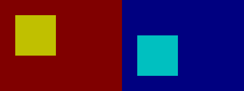

# bmp-js / Documentation / bmp_create
## Introduction

### Description

Create a BMP resource

### Parameters

|#|Name|Description|Default Value|
|-|-|-|-|
|1|width|Width  (X axis) of the image (non-zero) (limit: 16384)||
|2|height|Height (Y axis) of the image (non-zero) (limit: 16384)||
|3|canvas|When writing to a canvas this must be true|false|

### Returns
`false` | `BMPJS Resource`

### Notes

#### Canvas support

Couple of revisions back, BMPJS did not support Canvas. At first this wasn't a big problem until we wanted to write some animated demos.

Using Blobs for that is entirely impractical so I needed a workaround.

This is what the `canvas` parameter is for, if you create a resource with `canvas:true` then [`bmp_spawn()`](./bmp-spawn.md) will append an [`HTMLCanvasElement`](https://developer.mozilla.org/en-US/docs/Web/API/HTMLCanvasElement) instead of [`HTMLImageElement`](https://developer.mozilla.org/en-US/docs/Web/API/HTMLImageElement) to the target element.

It affects how [`bmp_get_pixel()`](./bmp-get-pixel.md) and [`bmp_set_pixel()`](./bmp-set-pixel.md) work under the hood, due to a different mapping of the bytes between a [BMP file](https://en.wikipedia.org/wiki/BMP_file_format) and the Canvas framebuffer we have to control the order of bytes and how we read from and write to them. You can take a look at those functions in [`bmp.js`](https://github.com/oxou/bmp-js/blob/main/bmp.js) to understand how the mapping is done between the two cases.

Such feature allows us to write directly to the framebuffer of that context with almost no loss in memory space or computing performance.

#### Canvas and Bitmap
Another key point to understand is that if you try to replace a resource within a reference which was initially created as a Canvas with another resource which was not, you will get an incorrect representation of the image.

Example:
```js
var resource_canvas = bmp_create(240, 180, true);
var resource_image  = bmp_create(240, 180, false);
var reference_canvas_1 = bmp_spawn(resource_canvas, container);
var reference_canvas_2 = bmp_spawn(resource_canvas, container);

// Plot both resources with the dark red background and a yellow rectangle
bmp_plot_clear(resource_canvas, 128, 0, 0);
bmp_plot_rect(resource_canvas, 30, 30, 80, 80, 192, 192, 0, true);

bmp_plot_clear(resource_image, 128, 0, 0);
bmp_plot_rect(resource_image, 30, 30, 80, 80, 192, 192, 0, true);

bmp_replace(reference_canvas_1, resource_canvas); // <--    canvas resource: ok
bmp_replace(reference_canvas_2, resource_image); // <-- non-canvas resource: bad
```

Returns:



As shown in the result, the 2nd picture looks completely different.

It is possible to set the resource's `canvas` property to `true` and redo the plot, which will result in the correct representation, but this style of "workarounds" is ugly, so whenever you're working with bmp-js always decide whether you're going to be making animations or static images so pick the right tool.

Canvas can also be used for static images, but some platforms may have Canvas disabled.

## Code examples

```js
// Create a 128 x 64 image
var resource_image = bmp_create(128, 64);
bmp_plot_clear(resource_image, 128, 0, 128);

// Create a 128 x 64 canvas
var resource_canvas = bmp_create(128, 64, true);
bmp_plot_clear(resource_canvas, 0, 128, 0);

// Spawn the image into the container
bmp_spawn(resource, container);
```

## Expected Result


