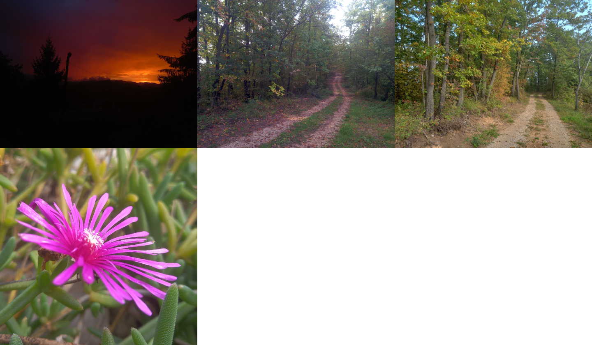

# bmp-js / Documentation / bmp_load

## Introduction

### Description

Similar to [`bmp_request()`](./bmp-request.md) but returns a BMPJS Resource automatically

### Parameters

|#|Name|Description|Default Value|
|-|-|-|-|
|1|url|URL pointing to a BMP file|null|
|2|canvas|When writing to a canvas this must be true|false|

### Returns
`false` | `BMPJS Resource`

## Code examples

```js
// Load 4 images
var resource_1 = bmp_load("docs/img/load/01.bmp");
var resource_2 = bmp_load("docs/img/load/02.bmp");
var resource_3 = bmp_load("docs/img/load/03.bmp");
var resource_4 = bmp_load("docs/img/load/04.bmp");

// Spawn the images into the container
bmp_spawn(resource_4, container);
bmp_spawn(resource_3, container);
bmp_spawn(resource_2, container);
bmp_spawn(resource_1, container);
```

## Expected Result


