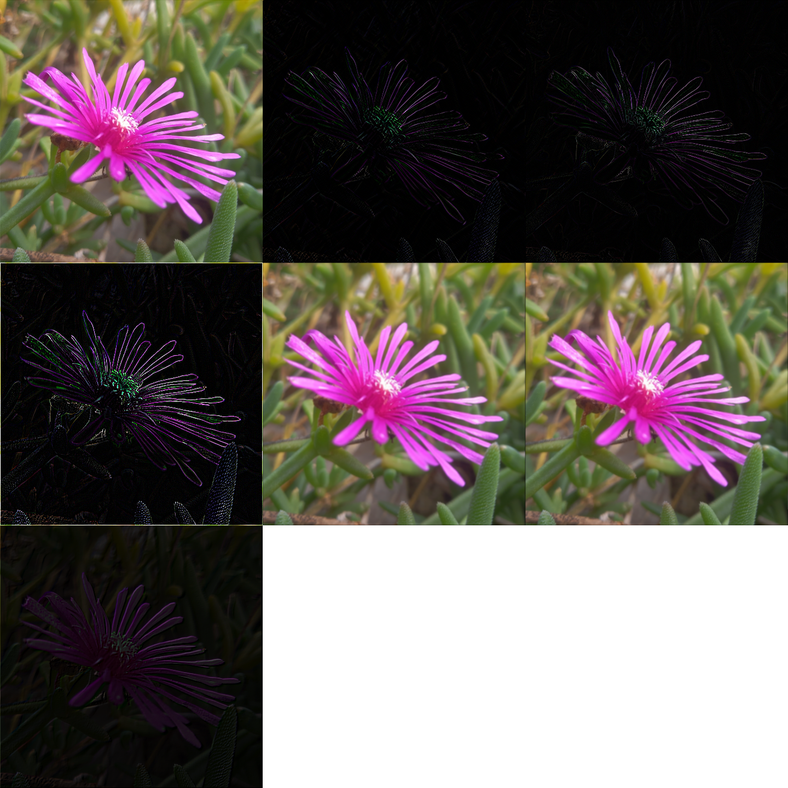

# bmp-js / Documentation / bmp_mod_apply_convolution_matrix
## Introduction

### Description

Apply a convolution matrix to an image.

More information about that here:

  - https://en.wikipedia.org/wiki/Kernel_(image_processing)
  - https://en.wikipedia.org/wiki/Convolution
  - https://docs.gimp.org/2.8/en/plug-in-convmatrix.html

### Parameters

1. `resource` | `BMPJS Resource`
2. `matrix` | `Convolution matrix (3x3 and 5x5 only)`
3. `divisor` | `How much to divide the average result (default 1)`
4. `offset` | `Value to add to the quotient (division result)`

Returns: BMPJS Resource `(object)`

## Code examples

```js
// Load image
var resource = bmp_request("docs/img/load/01.bmp");
    resource = bmp_create_from_bytes(resource);

// Apply effects
// Edge Detection #1
var resource_2 = bmp_mod_apply_convolution_matrix(
    resource,
    [
        1,  0, -1,
        0,  0,  0,
       -1,  0,  1
    ]
);

// Edge Detection #2
var resource_3 = bmp_mod_apply_convolution_matrix(
    resource,
    [
        0,  1,  0,
        1, -4,  1,
        0,  1,  0
    ]
);

// Edge Detection #3
var resource_4 = bmp_mod_apply_convolution_matrix(
    resource,
    [
       -1, -1, -1,
       -1,  8, -1,
       -1, -1, -1
    ]
);

// Box Blur
var resource_5 = bmp_mod_apply_convolution_matrix(
    resource,
    [
        1,  1,  1,
        1,  1,  1,
        1,  1,  1
    ],
    9
);

// Guassian Blur
var resource_6 = bmp_mod_apply_convolution_matrix(
    resource,
    [
        1,  2,  1,
        2,  4,  2,
        1,  2,  1
    ],
    16
);

// Emboss
var resource_7 = bmp_mod_apply_convolution_matrix(
    resource,
    [
       -2, -1,  0,
       -1,  1,  1,
        0,  1,  2
    ],
    9
);

// Spawn images
bmp_spawn(resource,   container);
bmp_spawn(resource_2, container);
bmp_spawn(resource_3, container);
bmp_spawn(resource_4, container);
bmp_spawn(resource_5, container);
bmp_spawn(resource_6, container);
bmp_spawn(resource_7, container);
```

## Expected Result


