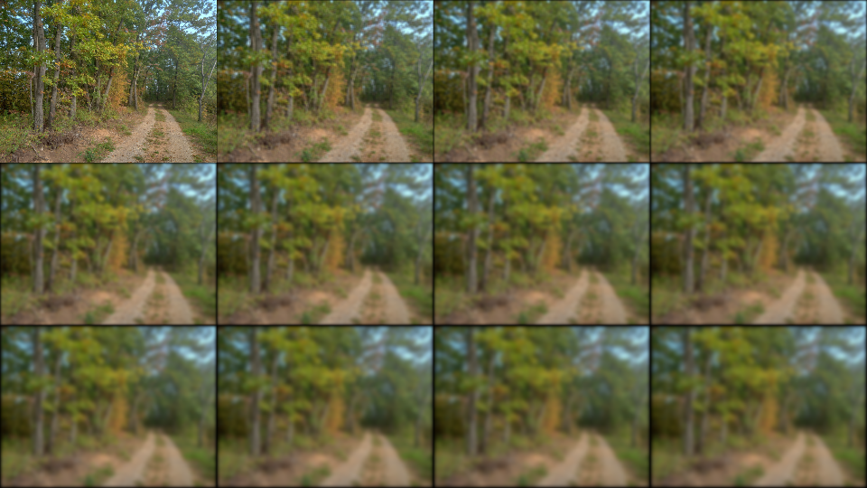

# bmp-js / Documentation / bmp_mod_blur_box
## Introduction

### Description

Box blur

### Parameters

1. `resource` | `BMPJS Resource`

Returns: BMPJS Resource `(object)`

## Code examples

```js
// Load image
var bmp_resource = bmp_resource_request("docs/img/load/2.bmp");
    bmp_resource = bmp_resource_create_from_bytes(bmp_resource);

// Blur
var bmp_resource_2 = bmp_mod_blur_box(bmp_resource);
var bmp_resource_3 = bmp_mod_blur_box(bmp_resource_2);
var bmp_resource_4 = bmp_mod_blur_box(bmp_resource_3);
var bmp_resource_5 = bmp_mod_blur_box(bmp_resource_4);
var bmp_resource_6 = bmp_mod_blur_box(bmp_resource_5);

// Spawn images
bmp_resource_spawn(bmp_resource,   bmp_container);
bmp_resource_spawn(bmp_resource_2, bmp_container);
bmp_resource_spawn(bmp_resource_3, bmp_container);
bmp_resource_spawn(bmp_resource_4, bmp_container);
bmp_resource_spawn(bmp_resource_5, bmp_container);
bmp_resource_spawn(bmp_resource_6, bmp_container);
```

## Expected Result


