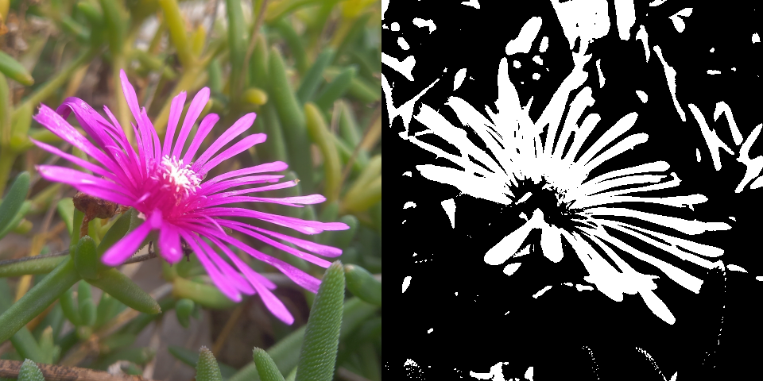

# bmp-js / Documentation / bmp_mod_color_1bit
## Introduction

### Description

Convert an image to appear like a 1-bit image

### Parameters

1. `resource` | `BMPJS Resource`

Returns: BMPJS Resource `(object)`

## Code examples

```js
// Load an example image
var bmp_resource_bytes = bmp_resource_request("docs/img/load/1.bmp");
var bmp_resource_1 = bmp_resource_create_from_bytes(bmp_resource_bytes);

// Convert bmp_resource_1 to 1-bit and store the new resource here
var bmp_resource_2 = bmp_mod_color_1bit(bmp_resource_1);

// Spawn the images into the container
bmp_resource_spawn(bmp_resource_1, bmp_container);
bmp_resource_spawn(bmp_resource_2, bmp_container);
```

## Expected Result


