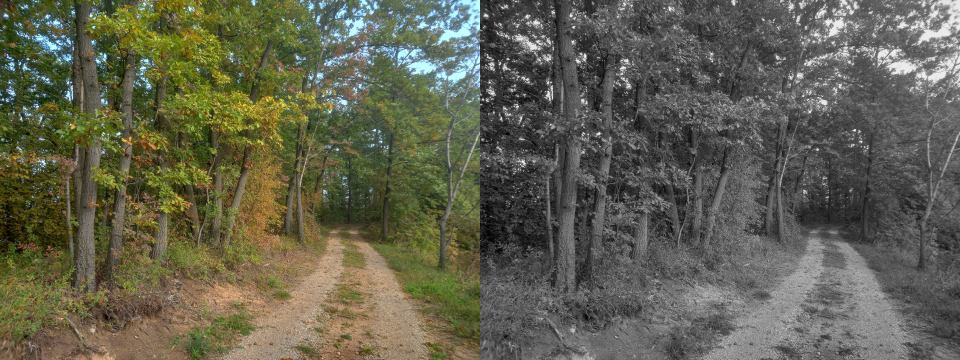

# bmp-js / Documentation / bmp_mod_color_grayscale
## Introduction

### Description

Turn colors to grayscale in an image

### Parameters

|#|Name|Description|Default Value|
|-|-|-|-|
|1|resource|BMPJS Resource||

### Returns
`BMPJS Resource`

## Code examples

```js
// Load an example image
var resource_1 = bmp_load("docs/img/load/02.bmp");

// Convert resource_1 to grayscale and store the new resource here
var resource_2 = bmp_mod_color_grayscale(resource_1);

// Spawn the images into the container
bmp_spawn(resource_1, container);
bmp_spawn(resource_2, container);
```

## Expected Result


