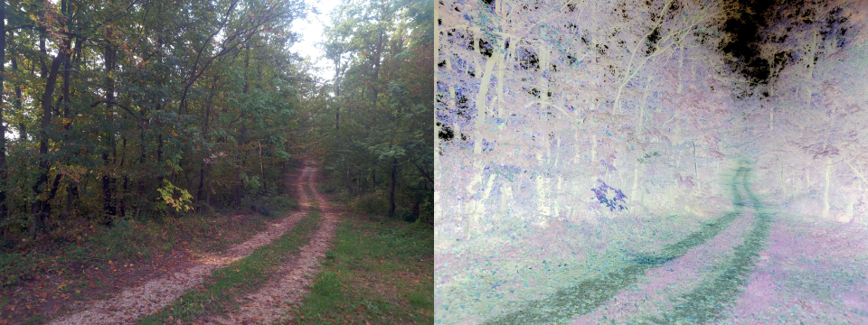

# bmp-js / Documentation / bmp_mod_color_invert
## Introduction

### Description

Invert colors of an image

### Parameters

1. `resource` | `BMPJS Resource`

Returns: BMPJS Resource `(object)`

## Code examples

```js
// Load an example image
var resource_bytes = bmp_request("docs/img/load/03.bmp");
var resource_1 = bmp_create_from_bytes(resource_bytes);

// Convert resource_1 to inverted colors and store the new resource here
var resource_2 = bmp_mod_color_invert(resource_1);

// Spawn the images into the container
bmp_spawn(resource_1, container);
bmp_spawn(resource_2, container);
```

## Expected Result


