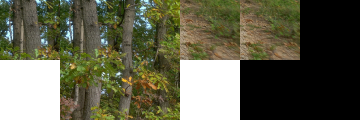
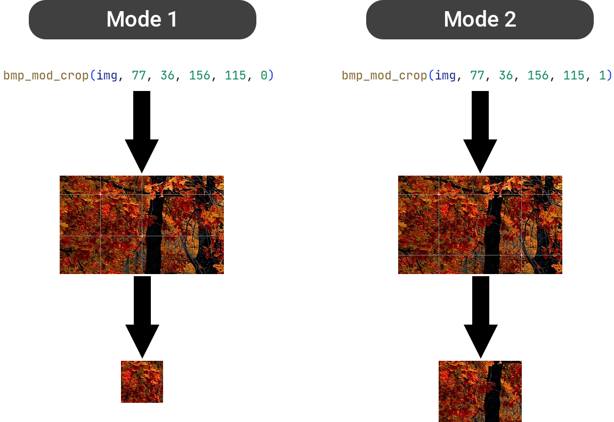

# bmp-js / Documentation / bmp_mod_crop
## Introduction

### Description

Crop an image.

In Mode 1, X1 and Y1 cannot be bigger than X2 and Y2 respectively.
X1 and Y1 define Point #1 on the image which is the starting point
and X2 and Y2 define Point #2 which is the ending point.
All values between those 2 points will be the returned resource
that contains the pixel data cropped within that area.

If X1 or Y1 are equal to their neighboring counterparts, then the
values of X2 or Y2 are incremented by 1.
If X1 is 42 and X2 is 42 then X2 will be 43 as we cannot return
a cropped image if the 2 points fall on the same exact coordinate,
that is we cannot have an image that is 0x0.

Mode 2 overrides the returned resources' width and height by treating
X2 and Y2 as the dimensions and not the 2nd point on the image.

If the width or height exceed the boundary of the affectee resource
then the value that bmp_resource_get_pixel() returns when out of bounds
by default will be written to the copy resource.

### Parameters

1. `resource` | `BMPJS Resource`
2. `x1` | `Position X #1`
3. `y1` | `Position Y #1`
4. `x2` | `Position X #2 (Mode 2 uses it as width)`
5. `y2` | `Position Y #2 (Mode 2 uses it as height)`
6. `mode2` | `This is so values [x2, y2] are used as width and height of the returned resource`

Returns: BMPJS Resource `(object)`

## Code examples

```js
// Load an example image
var bmp_resource_1_bytes = bmp_resource_request("docs/img/load/2.bmp");
var bmp_resource_1 = bmp_resource_create_from_bytes(bmp_resource_1_bytes);

// Crop image using mode 1 and 2
var bmp_resource_2 = bmp_mod_crop(bmp_resource_1, 60, 60, 120, 120, 0); // Mode 1
var bmp_resource_3 = bmp_mod_crop(bmp_resource_1, 60, 60, 120, 120, 1); // Mode 2

// Spawn the images into the container
bmp_resource_spawn(bmp_resource_2, bmp_container);
bmp_resource_spawn(bmp_resource_3, bmp_container);
```

## Expected Result



## Additional Information


