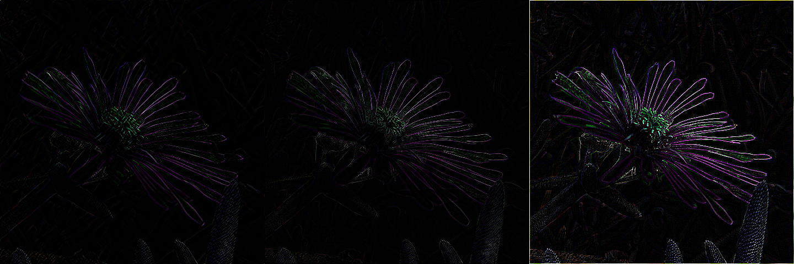

# bmp-js / Documentation / bmp_mod_detect_edge
## Introduction

### Description

Detect edges in an image

### Parameters

1. `resource` | `BMPJS Resource`
2. `mode` | `Available modes range from 0 to 2`

Returns: BMPJS Resource `(object)`

## Code examples

```js
// Load image
var bmp_resource = bmp_request("docs/img/load/01.bmp");
    bmp_resource = bmp_create_from_bytes(bmp_resource);

// Detect edges
var bmp_resource_2 = bmp_mod_detect_edge(bmp_resource, 0); // Mode 0
var bmp_resource_3 = bmp_mod_detect_edge(bmp_resource, 1); // Mode 1
var bmp_resource_4 = bmp_mod_detect_edge(bmp_resource, 2); // Mode 2

// Spawn images
bmp_spawn(bmp_resource_2, bmp_container);
bmp_spawn(bmp_resource_3, bmp_container);
bmp_spawn(bmp_resource_4, bmp_container);
```

## Expected Result


