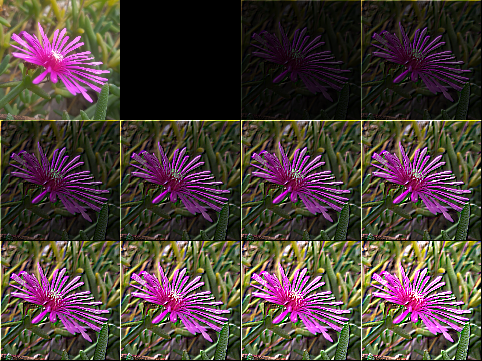

# bmp-js / Documentation / bmp_mod_emboss
## Introduction

### Description

Emboss

### Parameters

|#|Name|Description|Default Value|
|-|-|-|-|
|1|resource|BMPJS Resource||
|2|power|How many times to apply the convolution matrix (min 0.01)|1|

### Returns
`BMPJS Resource`

## Code examples

```js
// Load image
var resource = bmp_load("docs/img/load/01.bmp");

// Resize the image for easier showcase
resource = bmp_mod_resize(
    resource,
    resource.width  / 2,
    resource.height / 2
);

// Spawn original image
bmp_spawn(resource, container);

for (let i = 1; i < 12; i++) {
    // Spawn embossed images
    var resource_tmp = bmp_mod_emboss(resource, i);
    bmp_spawn(resource_tmp, container);
}
```

## Expected Result


