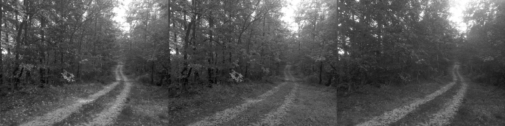

# bmp-js / Documentation / bmp_mod_get_channel
## Introduction

### Description

Retrieve a specific color channel from a resource

### Parameters

1. `resource` | `BMPJS Resource`
2. `channel` | `Channel index (0 = Red, 1 = Green, 2 = Blue) (default 0)`

Returns: BMPJS Resource `(object)`

## Code examples

```js
// Load an example image
var bmp_resource_bytes = bmp_resource_request("docs/img/load/03.bmp");
var bmp_resource = bmp_resource_create_from_bytes(bmp_resource_bytes);

// Extract all 3 channels
var bmp_resource_r = bmp_mod_get_channel(bmp_resource, 0);
var bmp_resource_g = bmp_mod_get_channel(bmp_resource, 1);
var bmp_resource_b = bmp_mod_get_channel(bmp_resource, 2);

// Spawn the images into the container
bmp_resource_spawn(bmp_resource_r, bmp_container);
bmp_resource_spawn(bmp_resource_g, bmp_container);
bmp_resource_spawn(bmp_resource_b, bmp_container);
```

## Expected Result


