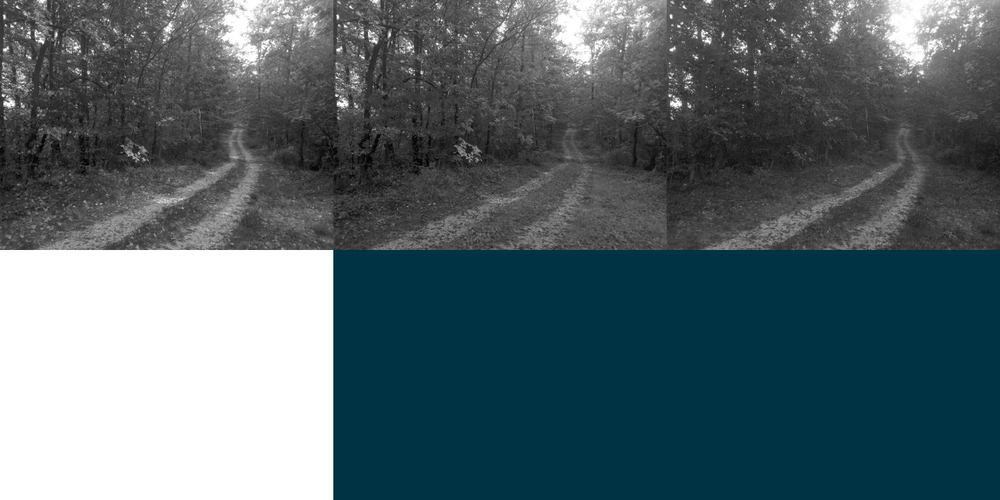

# bmp-js / Documentation / bmp_mod_get_channel
## Introduction

### Description

Retrieve a specific color channel from a resource

### Parameters

|#|Name|Description|Default Value|
|-|-|-|-|
|1|resource|BMPJS Resource||
|2|channel|Channel index (0=Red, 1=Green, 2=Blue, 3=Alpha)|0|

### Returns
`BMPJS Resource`

### Notes

Returning the Alpha channel should always return white, unless the BMP file has the Alpha channel affected through third-party tools.

White (255) means Opaque and Black (0) means Transparent, Gray (127) is between the two.

For more information about the Alpha channel, read the Wikipedia article [Alpha compositing](https://en.wikipedia.org/wiki/Alpha_compositing).

## Code examples

```js
// Make the body background darker so its easier
// to see all channels for presentation reasons
document.body.style.background = "#034";

// Load an example image
var resource = bmp_load("docs/img/load/03.bmp");

// Extract all 4 channels
var resource_r = bmp_mod_get_channel(resource, 0);
var resource_g = bmp_mod_get_channel(resource, 1);
var resource_b = bmp_mod_get_channel(resource, 2);
var resource_a = bmp_mod_get_channel(resource, 3);

// Spawn the images into the container
bmp_spawn(resource_r, container);
bmp_spawn(resource_g, container);
bmp_spawn(resource_b, container);
bmp_spawn(resource_a, container);
```

## Expected Result


