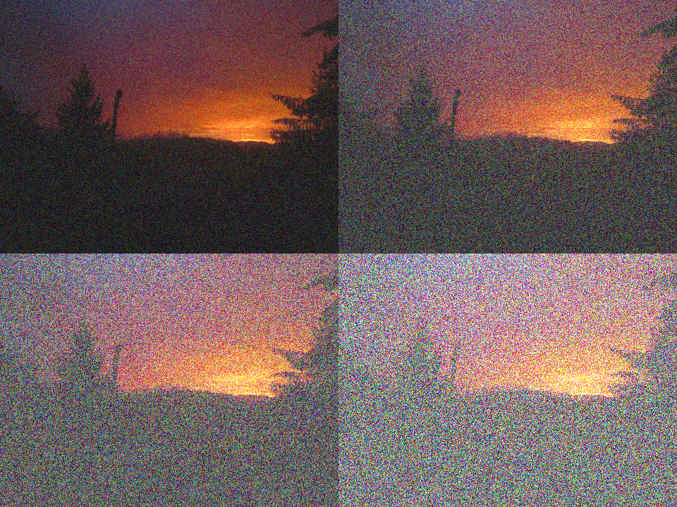

# bmp-js / Documentation / bmp_mod_noise_rgb
## Introduction

### Description

Add RGB noise to an image

### Parameters

|#|Name|Description|Default Value|
|-|-|-|-|
|1|resource|BMPJS Resource||
|2|scale|Amount of noise to add ranging from 0.0 to 10.0|0.1|

### Returns
`BMPJS Resource`

## Code examples

```js
// Load an example image
var resource_bytes = bmp_load("docs/img/load/04.bmp");

// Add noise with ranges of: 0.25, 0.50, 0.75, 1.00
var resource_2 = bmp_mod_noise_rgb(resource_1, 0.25);
var resource_3 = bmp_mod_noise_rgb(resource_1, 0.50);
var resource_4 = bmp_mod_noise_rgb(resource_1, 0.75);
var resource_5 = bmp_mod_noise_rgb(resource_1, 1.00);

// Spawn the images into the container
bmp_spawn(resource_2, container);
bmp_spawn(resource_3, container);
bmp_spawn(resource_4, container);
bmp_spawn(resource_5, container);
```

## Expected Result


