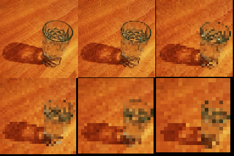

# bmp-js / Documentation / bmp_mod_pixelate
## Introduction

### Description

Pixelate an image

### Parameters

1. `resource` | `BMPJS Resource`
2. `factor` | `How much to divide image dimensions before upsampling (default 2, min 1)`

Returns: BMPJS Resource `(object)`

## Code examples

```js
// Load image
var bmp_resource = bmp_resource_request("docs/img/load/9.bmp");
    bmp_resource = bmp_resource_create_from_bytes(bmp_resource);

// Pixelate images
var bmp_resource_2 = bmp_mod_pixelate(bmp_resource, 1);
var bmp_resource_3 = bmp_mod_pixelate(bmp_resource, 2);
var bmp_resource_4 = bmp_mod_pixelate(bmp_resource, 3);
var bmp_resource_5 = bmp_mod_pixelate(bmp_resource, 4);
var bmp_resource_6 = bmp_mod_pixelate(bmp_resource, 5);
var bmp_resource_7 = bmp_mod_pixelate(bmp_resource, 6);

// Spawn images
bmp_resource_spawn(bmp_resource_2, bmp_container);
bmp_resource_spawn(bmp_resource_3, bmp_container);
bmp_resource_spawn(bmp_resource_4, bmp_container);
bmp_resource_spawn(bmp_resource_5, bmp_container);
bmp_resource_spawn(bmp_resource_6, bmp_container);
bmp_resource_spawn(bmp_resource_7, bmp_container);
```

## Expected Result


