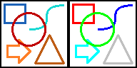

# bmp-js / Documentation / bmp_mod_replace_color
## Introduction

### Description

Replace a specific color in the image

### Parameters

1. `resource` | `BMPJS Resource`
2. `pr` | `Color channel Red (parent)`
3. `pg` | `Color channel Green (parent)`
4. `pb` | `Color channel Blue (parent)`
5. `cr` | `Color channel Red (child)`
6. `cg` | `Color channel Green (child)`
7. `cb` | `Color channel Blue (child)`

Returns: BMPJS Resource `(object)`

## Code examples

```js
// Load an example image
var bmp_resource_bytes = bmp_resource_request("docs/img/load/5.bmp");
var bmp_resource_1 = bmp_resource_create_from_bytes(bmp_resource_bytes);

// Spawn the (before) image into the container
bmp_resource_spawn(bmp_resource_1, bmp_container);

// Replace colors
bmp_resource_1 = bmp_mod_replace_color(bmp_resource_1,  28,  98, 183, 255,   0,   0);
bmp_resource_1 = bmp_mod_replace_color(bmp_resource_1, 192,   0,   0,   0, 255,   0);
bmp_resource_1 = bmp_mod_replace_color(bmp_resource_1,  23, 217, 211,   0,   0, 255);
bmp_resource_1 = bmp_mod_replace_color(bmp_resource_1, 255, 127,  39,   0, 255, 255);
bmp_resource_1 = bmp_mod_replace_color(bmp_resource_1, 190,  92,  20, 192, 192, 192);

// Spawn the (after) image into the container
bmp_resource_spawn(bmp_resource_1, bmp_container);
```

## Expected Result


