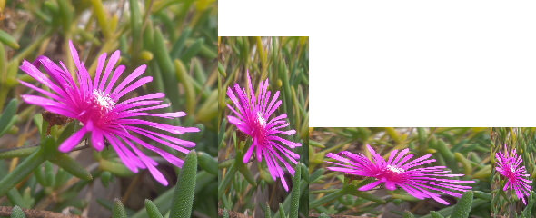

# bmp-js / Documentation / bmp_mod_resize
## Introduction

### Description

Resize an image (using nearest neighbor)

### Parameters

1. `resource` | `BMPJS Resource`
2. `w` | `Width  (Rounded to nearest place)`
3. `h` | `Height (Rounded to nearest place)`

Returns: BMPJS Resource `(object)`

## Code examples

```js
// Load image
var bmp_resource = bmp_request("docs/img/load/01.bmp");
    bmp_resource = bmp_create_from_bytes(bmp_resource);

// Resize images
var bmp_resource_2 = bmp_mod_resize(bmp_resource, 240, 240);
var bmp_resource_3 = bmp_mod_resize(bmp_resource, 100, 200);
var bmp_resource_4 = bmp_mod_resize(bmp_resource, 200, 100);
var bmp_resource_5 = bmp_mod_resize(bmp_resource,  50, 100);

// Spawn images
bmp_spawn(bmp_resource_2, bmp_container);
bmp_spawn(bmp_resource_3, bmp_container);
bmp_spawn(bmp_resource_4, bmp_container);
bmp_spawn(bmp_resource_5, bmp_container);
```

## Expected Result


