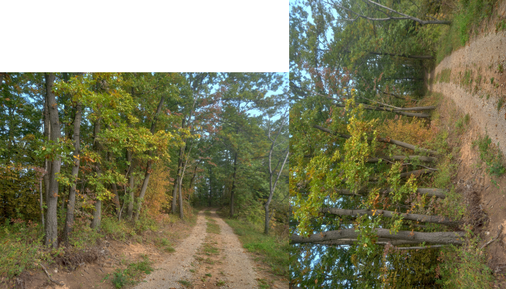

# bmp-js / Documentation / bmp_mod_rotate_left
## Introduction

### Description

Rotate the image to the left

### Parameters

1. `resource` | `BMPJS Resource`

Returns: BMPJS Resource `(object)`

## Code examples

```js
// Load an example image
var bmp_resource_bytes = bmp_resource_request("docs/img/load/2.bmp");
var bmp_resource = bmp_resource_create_from_bytes(bmp_resource_bytes);

// Spawn the (before) image into the container
bmp_resource_spawn(bmp_resource, bmp_container);

// Rotate left
bmp_resource = bmp_mod_rotate_left(bmp_resource);

// Spawn the (after) image into the container
bmp_resource_spawn(bmp_resource, bmp_container);
```

## Expected Result


