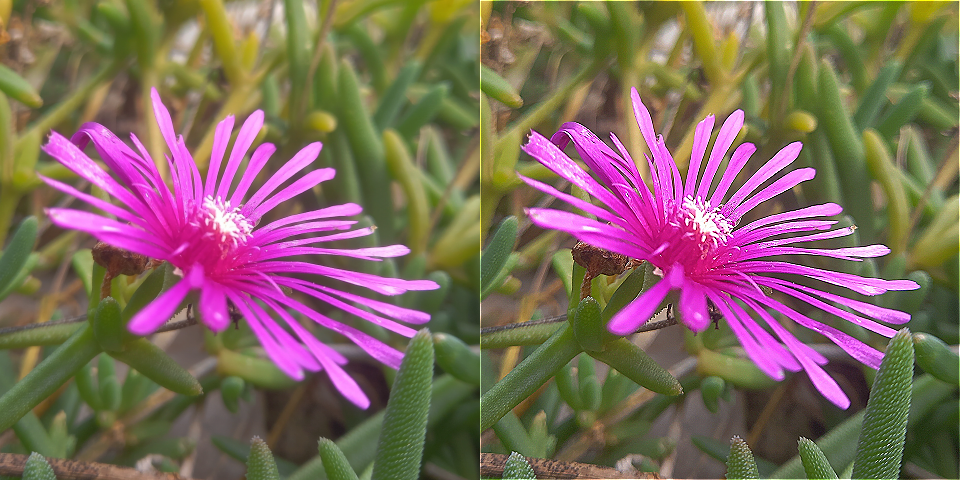

# bmp-js / Documentation / bmp_mod_sharpen
## Introduction

### Description

Sharpen an image

### Parameters

1. `resource` | `BMPJS Resource`

Returns: BMPJS Resource `(object)`

## Code examples

```js
// Load image
var resource = bmp_request("docs/img/load/01.bmp");
    resource = bmp_create_from_bytes(resource);

// Sharpen images
var resource_2 = bmp_mod_sharpen(resource);

// Spawn images
bmp_spawn(resource,   container);
bmp_spawn(resource_2, container);
```

## Expected Result


