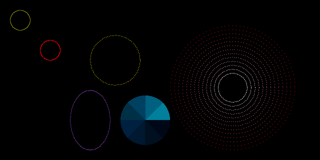

# bmp-js / Documentation / bmp_plot_circle
## Introduction

### Description

Plot a circle

### Parameters

|#|Name|Description|Default Value|
|-|-|-|-|
|1|resource|BMPJS Resource||
|2|x|Position X||
|3|y|Position Y||
|4|w|Width||
|5|h|Height||
|6|r|Color channel Red||
|7|g|Color channel Green||
|8|b|Color channel Blue||
|9|p|Precision of line (clamped from 0.1 to 2) (ignored on fill)|1|
|10|fill|Fill the area with color|false|
|11|center|Treat X and Y as the center point of the circle|false|
|12|angles|Across what angle to plot the circle|360|

### Returns
`true`

## Code examples

```js
// Create image
var resource = bmp_create(640, 320);

// Draw shapes
bmp_plot_circle(resource,  20,  20,   40,  40, 128, 128,   0, 2.00);
bmp_plot_circle(resource,  80,  80,   40,  40, 255,   0,   0, 1.00);
bmp_plot_circle(resource, 140, 180,   80, 120, 128,  64, 192, 0.50);
bmp_plot_circle(resource, 180,  70,  100, 100, 255, 255,   0, 0.25);
bmp_plot_circle(resource, 340,  50,  250, 250,   0, 128, 255, 0.25, false);

for (let i = 0, max = 50; i < max; i += 4) {
    var _r = lerp(255, 255, i / max);
    var _g = lerp(0,   255, i / max);
    var _b = lerp(0,   255, i / max);

    bmp_plot_circle(
        resource,
        // position
        340 + (i * 2),
        50  + (i * 2),
        // dimension
        250 - (i * 4),
        250 - (i * 4),
        // colors
        _r,
        _g,
        _b,
        0.25, // precision
        false // fill
    );
}

bmp_plot_circle(resource, 240, 190,  100, 100,   0, 128, 156, 0.25, true, false, 360);
bmp_plot_circle(resource, 240, 190,  100, 100,   0,  96, 128, 0.25, true, false, 315);
bmp_plot_circle(resource, 240, 190,  100, 100,   0,  64,  96, 0.25, true, false, 270);
bmp_plot_circle(resource, 240, 190,  100, 100,   0,  48,  70, 0.25, true, false, 225);
bmp_plot_circle(resource, 240, 190,  100, 100,   0,  32,  64, 0.25, true, false, 180);
bmp_plot_circle(resource, 240, 190,  100, 100,   0,  24,  48, 0.25, true, false, 135);
bmp_plot_circle(resource, 240, 190,  100, 100,   0,  16,  32, 0.25, true, false,  90);
bmp_plot_circle(resource, 240, 190,  100, 100,   0,   8,  24, 0.25, true, false,  45);

// Spawn images
bmp_spawn(resource, container);
```

## Expected Result


