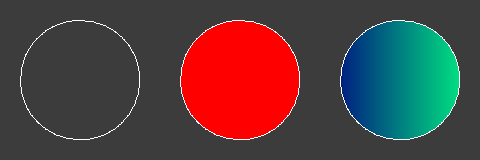

# bmp-js / Documentation / bmp_plot_fill
## Introduction

### Description

Fill the area with the given color starting from x,y until all occurences of the background color have been replaced in that area.

### Parameters

|#|Name|Description|Default Value|
|-|-|-|-|
|1|resource|BMPJS Resource||
|2|x|Position X||
|3|y|Position Y||
|4|r|Color channel Red||
|5|g|Color channel Green||
|6|b|Color channel Blue||
|7|callback|Callback function|[`bmp_set_pixel`](./bmp-set-pixel.md)|

### Returns
`true`

### Notes

Take care when specifying a callback function, there are cases where the function may enter an infinite loop based on the logic inside of the callback function.

## Code examples

```js
// Create image
var resource = bmp_create(160, 160);

// Clear the entire resource's background
bmp_plot_clear(resource, 60, 60, 60);

// Plot a circle at 20, 20 with the dimensions of 120, 120
bmp_plot_circle(resource, 20, 20, 120, 120, 255, 255, 255);

// Spawn the image
bmp_spawn(resource, container);

// Fill the circle with red
bmp_plot_fill(
    resource,
    80, 80,
    255, 0, 0
);

// Spawn the image
bmp_spawn(resource, container);

// Fill the circle again but using a callback function.
// Warning: This approach can lead to unexpected results and even crashes,
// proceed with care.
bmp_plot_fill(
    resource,
    80, 80,
    255, 255, 0,
    (res, x, y, r, g, b) => {
        var lerp = res.width / 100 * x;
        bmp_set_pixel(res, x, y, 0, lerp, 128);
    }
);

// Spawn the image
bmp_spawn(resource, container);
```

## Expected Result


