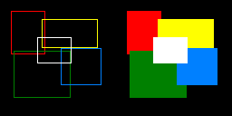

# bmp-js / Documentation / bmp_plot_rect
## Introduction

### Description

Plot a rectangle

### Parameters

1. `resource` | `BMPJS Resource`
2. `x` | `Position X`
3. `y` | `Position Y`
4. `w` | `Width`
5. `h` | `Height`
6. `r` | `Color channel Red`
7. `g` | `Color channel Green`
8. `b` | `Color channel Blue`

Returns: true `(boolean)`

## Code examples

```js
// Create image
var bmp_resource = bmp_create(128, 128);

// Plot some rectangles
bmp_plot_rect(bmp_resource, 12, 12, 38, 48, 255,   0,   0);
bmp_plot_rect(bmp_resource, 46, 21, 62, 32, 255, 255,   0);
bmp_plot_rect(bmp_resource, 15, 56, 63, 52,   0, 128,   0);
bmp_plot_rect(bmp_resource, 67, 53, 45, 41,   0, 128, 255);
bmp_plot_rect(bmp_resource, 41, 41, 38, 29, 255, 255, 255);

// Spawn the image into the container
bmp_spawn(bmp_resource, bmp_container);
```

## Expected Result


