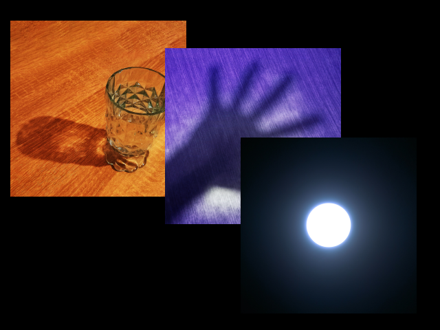

# bmp-js / Documentation / bmp_plot_resource
## Introduction

### Description

Copy the contents from a resource child to the resource parent

### Parameters

|#|Name|Description|Default Value|
|-|-|-|-|
|1|resource_p|BMPJS Resource (parent)||
|2|resource_c|BMPJS Resource (child)||
|3|x|Position X|0|
|4|y|Position Y|0|
|5|w|Width (-1 = child's width)|-1|
|6|h|Height (-1 = child's height)|-1|
|7|ox|Offset to add to the X position of child|0|
|8|oy|Offset to add to the Y position of child|0|
|9|transparent|Handle tr, tg and tb colors as transparency|false|
|10|tr|Red channel to be used as transparency|-1|
|11|tg|Green channel to be used as transparency|-1|
|12|tb|Blue channel to be used as transparency|-1|

### Returns
`true`

## Code examples

```js
// Create image in which we'll plot other images
var resource_1 = bmp_create(640, 480);

// Load other images
var resource_2 = bmp_load("docs/img/load/06.bmp");
var resource_3 = bmp_load("docs/img/load/07.bmp");
var resource_4 = bmp_load("docs/img/load/08.bmp");
var resource_5 = bmp_load("docs/img/load/10.bmp");
var resource_6 = bmp_load("docs/img/load/11.bmp");

// Plot images
bmp_plot_resource(resource_1, resource_2, 15, 30);
bmp_plot_resource(resource_1, resource_3, 240, 70);
bmp_plot_resource(resource_1, resource_4, 350, 200);
bmp_plot_resource(resource_1, resource_5, 560, 16);

// Plot images with an offset
bmp_plot_resource(resource_1, resource_5, 16 * 2, 400, 16, 16, 16 * 0);
bmp_plot_resource(resource_1, resource_5, 16 * 4, 400, 16, 16, 16 * 1);
bmp_plot_resource(resource_1, resource_5, 16 * 6, 400, 16, 16, 16 * 2);
bmp_plot_resource(resource_1, resource_5, 16 * 8, 400, 16, 16, 16 * 3);

// Plot images with alpha-like properties
bmp_plot_resource(resource_1, resource_6, 100, 100, -1, -1, 0, 0, true, 255, 0, 255);
bmp_plot_resource(resource_1, resource_6, 130, 100, -1, -1, 0, 0);
bmp_plot_resource(resource_1, resource_6, 130, 175, -1, -1, 0, 0, true, 0, 0, 0);

// Spawn the image into the container
bmp_spawn(resource_1, container);
```

## Expected Result


