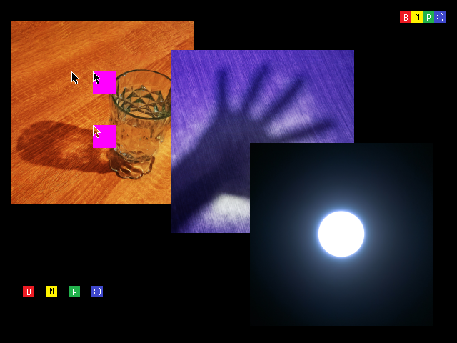

# bmp-js / Documentation / bmp_plot_resource
## Introduction

### Description

Copy the contents from a resource child to the resource parent

### Parameters

1. `resource_p` | `BMPJS resource (parent)`
2. `resource_c` | `BMPJS resource (child)`
3. `x` | `Position X`
4. `y` | `Position Y`
5. `w` | `Width (by default -1, child's width)`
6. `h` | `Height (by default -1, child's height)`

Returns: true `(boolean)`

## Code examples

```js
// Create image in which we'll plot other images
var bmp_resource_1 = bmp_resource_create(640, 480);

// Load other images
var bmp_resource_2 = bmp_resource_request("docs/img/load/6.bmp");
    bmp_resource_2 = bmp_resource_create_from_bytes(bmp_resource_2);

var bmp_resource_3 = bmp_resource_request("docs/img/load/7.bmp");
    bmp_resource_3 = bmp_resource_create_from_bytes(bmp_resource_3);

var bmp_resource_4 = bmp_resource_request("docs/img/load/8.bmp");
    bmp_resource_4 = bmp_resource_create_from_bytes(bmp_resource_4);

// Plot images
bmp_plot_resource(bmp_resource_1, bmp_resource_2, 15, 30);
bmp_plot_resource(bmp_resource_1, bmp_resource_3, 240, 70);
bmp_plot_resource(bmp_resource_1, bmp_resource_4, 350, 200);

// Spawn the image into the container
bmp_resource_spawn(bmp_resource_1, bmp_container);
```

## Expected Result


