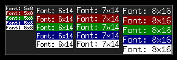
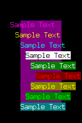

# bmp-js / Documentation / bmp_plot_text
## Introduction

### Description

Use a loaded image resource that contains a character set range from 0x20 to 0x80 to plot text

### Parameters

|#|Name|Description|Default Value|
|-|-|-|-|
|1|resource_p|BMPJS Resource (parent)||
|2|resource_c|BMPJS Resource (child)||
|3|x|Position X||
|4|y|Position Y||
|5|text|Input String|A|
|6|wrap|Does text wrap around|true|
|7|fr|Color channel Red (foreground)|255|
|8|fg|Color channel Green (foreground)|255|
|9|fb|Color channel Blue (foreground)|255|
|10|fr|Color channel Red (background)|-1|
|11|fg|Color channel Green (background)|-1|
|12|fb|Color channel Blue (background)|-1|

### Returns
`true`

### Notes

If either `fr`, `fg` or `fb` are `-1` then the background color won't be applied.

See `Code example #2`.

## Code examples

### Code example #1

```js
// Create image in which we'll plot text
var resource = bmp_create(292, 100);

// Plot a rectangle in which we'll position the text
bmp_plot_rect(resource, 8, 8, 277, 84, 128, 128, 128, true);
bmp_plot_rect(resource, 9, 9, 275, 82,  32,  32,  32, true);

// Load font bitmaps
var font_1 = bmp_load("demo/images/font/5x8/0.bmp");
var font_2 = bmp_load("demo/images/font/6x14/0.bmp");
var font_3 = bmp_load("demo/images/font/7x14/0.bmp");
var font_4 = bmp_load("demo/images/font/8x16/0.bmp");

// Acquire information about fonts, their width and height
var font_1_props = bmp_mod_dissect_font(font_1);
var font_2_props = bmp_mod_dissect_font(font_2);
var font_3_props = bmp_mod_dissect_font(font_3);
var font_4_props = bmp_mod_dissect_font(font_4);

// Y offset that we'll use as we plot text
var x_offset = 10;
var y_offset = 10;

// Plot text (font_1)
bmp_plot_text(resource, font_1, x_offset, y_offset, "Font: 5x8");
y_offset += font_1_props[1];

bmp_plot_text(resource, font_1, x_offset, y_offset, "Font: 5x8", true, 255, 255, 255, 128,   0,   0);
y_offset += font_1_props[1];

bmp_plot_text(resource, font_1, x_offset, y_offset, "Font: 5x8", true, 255, 255, 255,   0, 128,   0);
y_offset += font_1_props[1];

bmp_plot_text(resource, font_1, x_offset, y_offset, "Font: 5x8", true, 255, 255, 255,   0,   0, 128);
y_offset += font_1_props[1];

bmp_plot_text(resource, font_1, x_offset, y_offset, "Font: 5x8", true,   0,   0,   0, 255, 255, 255);
x_offset += font_1_props[0] * ("Font: 5x8").length + font_1_props[0];
y_offset = 10;

// Plot text (font_2)
bmp_plot_text(resource, font_2, x_offset, y_offset, "Font: 6x14");
y_offset += font_2_props[1];

bmp_plot_text(resource, font_2, x_offset, y_offset, "Font: 6x14", true, 255, 255, 255, 128,   0,   0);
y_offset += font_2_props[1];

bmp_plot_text(resource, font_2, x_offset, y_offset, "Font: 6x14", true, 255, 255, 255,   0, 128,   0);
y_offset += font_2_props[1];

bmp_plot_text(resource, font_2, x_offset, y_offset, "Font: 6x14", true, 255, 255, 255,   0,   0, 128);
y_offset += font_2_props[1];

bmp_plot_text(resource, font_2, x_offset, y_offset, "Font: 6x14", true,   0,   0,   0, 255, 255, 255);
x_offset += font_2_props[0] * ("Font: 6x14").length + font_2_props[0];
y_offset = 10;

// Plot text (font_3)
bmp_plot_text(resource, font_3, x_offset, y_offset, "Font: 7x14");
y_offset += font_3_props[1];

bmp_plot_text(resource, font_3, x_offset, y_offset, "Font: 7x14", true, 255, 255, 255, 128,   0,   0);
y_offset += font_3_props[1];

bmp_plot_text(resource, font_3, x_offset, y_offset, "Font: 7x14", true, 255, 255, 255,   0, 128,   0);
y_offset += font_3_props[1];

bmp_plot_text(resource, font_3, x_offset, y_offset, "Font: 7x14", true, 255, 255, 255,   0,   0, 128);
y_offset += font_3_props[1];

bmp_plot_text(resource, font_3, x_offset, y_offset, "Font: 7x14", true,   0,   0,   0, 255, 255, 255);
x_offset += font_3_props[0] * ("Font: 7x14").length + font_3_props[0];
y_offset = 10;

// Plot text (font_4)
bmp_plot_text(resource, font_4, x_offset, y_offset, "Font: 8x16");
y_offset += font_4_props[1];

bmp_plot_text(resource, font_4, x_offset, y_offset, "Font: 8x16", true, 255, 255, 255, 128,   0,   0);
y_offset += font_4_props[1];

bmp_plot_text(resource, font_4, x_offset, y_offset, "Font: 8x16", true, 255, 255, 255,   0, 128,   0);
y_offset += font_4_props[1];

bmp_plot_text(resource, font_4, x_offset, y_offset, "Font: 8x16", true, 255, 255, 255,   0,   0, 128);
y_offset += font_4_props[1];

bmp_plot_text(resource, font_4, x_offset, y_offset, "Font: 8x16", true,   0,   0,   0, 255, 255, 255);

// Spawn the image into the container
bmp_spawn(resource, container);
```

## Expected Result



---

### Code example #2
```js
// Create image in which we'll plot text
var resource = bmp_create(160, 240);

// Plot a rectangle
bmp_plot_rect(resource, 40, 40, 80, 160, 128, 0, 128, true);

// Load font bitmap
var font_1 = bmp_load("demo/images/font/8x16/0.bmp");

// Acquire information about fonts, their width and height
var font_1_props = bmp_mod_dissect_font(font_1);

// Plot text with various styles
bmp_plot_text(resource, font_1, 20,  40, "Sample Text", true, 255,   0, 255,  -1,  -1,  -1);
bmp_plot_text(resource, font_1, 30,  60, "Sample Text", true, 255, 255,   0,  -1,  -1,  -1);
bmp_plot_text(resource, font_1, 40,  80, "Sample Text", true,   0, 255, 255,  -1,  -1,  -1);
bmp_plot_text(resource, font_1, 50, 100, "Sample Text", true,   0,   0,   0, 255, 255, 255);
bmp_plot_text(resource, font_1, 60, 120, "Sample Text", true, 255, 255, 255,   0, 128,   0);
bmp_plot_text(resource, font_1, 70, 140, "Sample Text", true, 255,   0,   0, 128,   0,   0);
bmp_plot_text(resource, font_1, 60, 160, "Sample Text", true, 255, 255,   0, 128, 128,   0);
bmp_plot_text(resource, font_1, 50, 180, "Sample Text", true,   0, 255,   0,   0, 128,   0);
bmp_plot_text(resource, font_1, 40, 200, "Sample Text", true, 255, 255, 255,   0, 128, 128);

// Spawn the image into the container
bmp_spawn(resource, container);
```

## Expected Result


