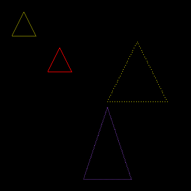

# bmp-js / Documentation / bmp_plot_triangle
## Introduction

### Description

Plot a triangle

### Parameters

1. `resource` | `BMPJS Resource`
2. `x` | `Position X`
3. `y` | `Position Y`
4. `w` | `Width`
5. `h` | `Height`
6. `r` | `Color channel Red`
7. `g` | `Color channel Green`
8. `b` | `Color channel Blue`
9. `p` | `Precision of line (clamped from 0.1 to 2)`

Returns: true `(boolean)`

## Code examples

```js
// Load image
var bmp_resource = bmp_create(320, 320);

// Draw shapes
bmp_plot_triangle(bmp_resource,  20,  20,   40,  40, 128, 128,   0, 2.00);
bmp_plot_triangle(bmp_resource,  80,  80,   40,  40, 255,   0,   0, 1.00);
bmp_plot_triangle(bmp_resource, 140, 180,   80, 120, 128,  64, 192, 0.50);
bmp_plot_triangle(bmp_resource, 180,  70,  100, 100, 255, 255,   0, 0.25);

// Spawn images
bmp_spawn(bmp_resource, bmp_container);
```

## Expected Result


