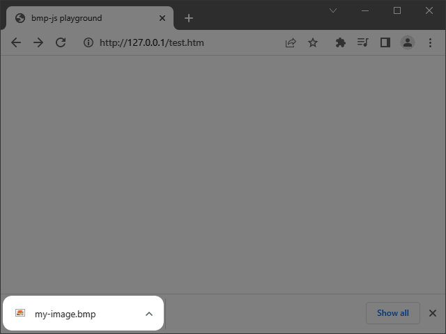
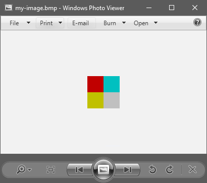

# bmp-js / Documentation / bmp_resource_download

## Introduction

### Description

Prompt for a download of BMPJS resource.

### Parameters

1. `resource` | `BMPJS Resource`
2. `filename` | `Name of the downloaded file (default: download.bmp)`

Returns: false | true `(boolean)`

## Code examples

```js
// Create a sample picture
var bmp_resource = bmp_resource_create(64, 64);

// Plot rectangles with various colors
bmp_plot_rect(bmp_resource,  0,  0, 32, 32, 192,   0,   0);
bmp_plot_rect(bmp_resource,  0, 32, 32, 32, 192, 192,   0);
bmp_plot_rect(bmp_resource, 32, 32, 32, 32, 192, 192, 192);
bmp_plot_rect(bmp_resource, 32,  0, 32, 32,   0, 192, 192);

// Download the resource
bmp_resource_download(bmp_resource, "my-image.bmp");
```

## Expected Result



