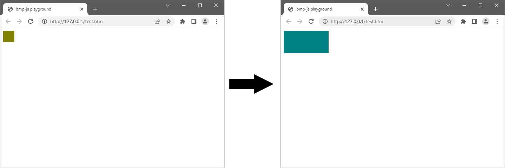

# bmp-js / Documentation / bmp_replace
## Introduction

### Description

Replace the URI from the old `img` element referenced through `target` by creating a new one by `resource`

### Parameters

1. `target` | `img element pointing to a previous reference returned by bmp_spawn()`
2. `resource` | `BMPJS Resource`

Returns: false | true `(boolean)`

## Code examples

```js
// Create a sample picture
var bmp_resource_1 = bmp_create(32, 32);

// Clear the resource with a Dark Yellow color
bmp_plot_clear(bmp_resource_1, 128, 128, 0);

// Spawn the image into the container, but assign the
// return value to a spawn_reference variable
var spawn_reference = bmp_spawn(bmp_resource_1, bmp_container);

// Now let's create a different resource, with different dimensions and colors
var bmp_resource_2 = bmp_create(128, 64);

// Clear the resource with a Dark Blue color
bmp_plot_clear(bmp_resource_2, 0, 128, 128);

// Replace the spawned bmp_resource_1 with the bmp_resource_2
bmp_replace(spawn_reference, bmp_resource_2);
```

## Expected Result


