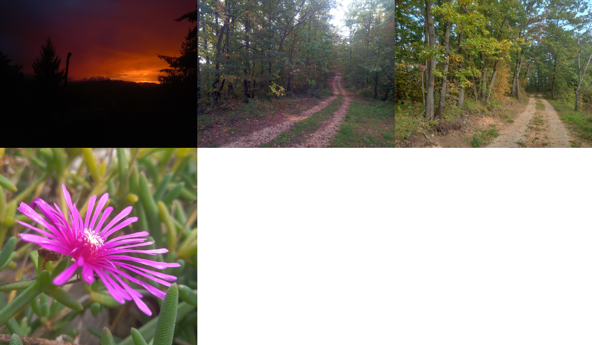

# bmp-js / Documentation / bmp_resource_request

## Introduction

### Description

Request a BMP file from a remote location using synchronous XMLHttpRequest.

Thanks to: [https://tinyurl.com/SendingAndReceivingBinaryData](https://tinyurl.com/SendingAndReceivingBinaryData)

### Parameters

1. `url` | `URL pointing to a BMP file`

Returns: false | null | string `(boolean|null|string)`

### Notes

Before spawning the requested resource, once it has loaded, the resource must be created using the [`bmp_resource_create_from_bytes()`](./bmp-resource-create-from-bytes.md) function.

## Code examples

```js
// Load 4 images
var bmp_resource_1 = bmp_resource_request("docs/img/load/1.bmp");
var bmp_resource_2 = bmp_resource_request("docs/img/load/2.bmp");
var bmp_resource_3 = bmp_resource_request("docs/img/load/3.bmp");
var bmp_resource_4 = bmp_resource_request("docs/img/load/4.bmp");

// Create BMP resources from bytes
bmp_resource_1 = bmp_resource_create_from_bytes(bmp_resource_1);
bmp_resource_2 = bmp_resource_create_from_bytes(bmp_resource_2);
bmp_resource_3 = bmp_resource_create_from_bytes(bmp_resource_3);
bmp_resource_4 = bmp_resource_create_from_bytes(bmp_resource_4);

// Spawn the images into the container
bmp_resource_spawn(bmp_resource_4, bmp_container);
bmp_resource_spawn(bmp_resource_3, bmp_container);
bmp_resource_spawn(bmp_resource_2, bmp_container);
bmp_resource_spawn(bmp_resource_1, bmp_container);
```

## Expected Result


