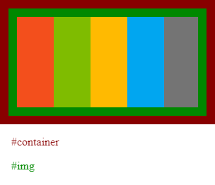

# bmp-js / Documentation / bmp_spawn
## Introduction

### Description

Creates an `img` element that is appended to the `target`. The image element src is set to the output of `bmp_create_uri(resource)`

### Parameters

1. `resource` | `BMPJS Resource`
2. `target` | `HTMLElement in which the image will be appended to`

Returns: false | Reference to the `img` element `(boolean|htmlelement)`

## Code examples

```js
// Add CSS
var raw_css = `
#container,
#img {
    border: 12px solid #800;
    display: inline-block
}

#img {
    border-color: #080
}

p {
    padding-left: 16px
}
`;

var style_element = document.createElement("style");
style_element.innerHTML = raw_css;
document.body.appendChild(style_element);

// Create a container element in which we will spawn an image
var container = document.createElement("div");
container.id = "container";

// Define image width and height, which will be used to calculate
// each box width and their X position relative to the parent
var image_width  = 256;
var image_height = 128;
var box_width    = Math.ceil(image_width / 5);
var box_height   = image_height;

// Create BMPJS resource
var image = bmp_create(image_width, image_height);

// Plot 5 rectangles spanning across the X axis
bmp_plot_rect(image, box_width * 0, 0, box_width, box_height, 243,  79,  28);
bmp_plot_rect(image, box_width * 1, 0, box_width, box_height, 127, 188,   0);
bmp_plot_rect(image, box_width * 2, 0, box_width, box_height, 255, 186,   1);
bmp_plot_rect(image, box_width * 3, 0, box_width, box_height,   1, 166, 240);
bmp_plot_rect(image, box_width * 4, 0, box_width, box_height, 116, 116, 116);

// Spawn the image, storing the reference
var image_reference = bmp_spawn(image, container);
image_reference.id = "img";

// Append the container element to the body. The container may be appended
// before or after a resource has been spawned. What matters is that the
// target is of HTMLElement type, else the spawn function will fail.
document.body.appendChild(container);

// Create brief description about elements
var text_1 = document.createElement("p");
text_1.innerText = "#container";
text_1.style.color = "#800";

var text_2 = document.createElement("p");
text_2.innerText = "#img";
text_2.style.color = "#080";

document.body.appendChild(text_1);
document.body.appendChild(text_2);
```

## Expected Result


