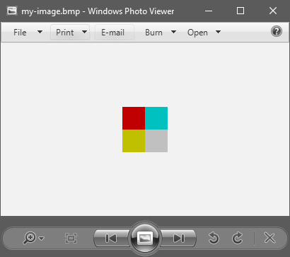

# bmp-js / Documentation / bmp_save

## Introduction

### Description

Prompt for a download of BMPJS resource.

### Parameters

|#|Name|Description|Default Value|
|-|-|-|-|
|1|resource|BMPJS Resource||
|2|filename|Name of the downloaded file|download.bmp|

### Returns
`false` | `true`

## Code examples

```js
// Create a sample picture
var resource = bmp_create(64, 64);

// Plot rectangles with various colors
bmp_plot_rect(resource,  0,  0, 32, 32, 192,   0,   0, true);
bmp_plot_rect(resource,  0, 32, 32, 32, 192, 192,   0, true);
bmp_plot_rect(resource, 32, 32, 32, 32, 192, 192, 192, true);
bmp_plot_rect(resource, 32,  0, 32, 32,   0, 192, 192, true);

// Download the resource
bmp_save(resource, "my-image.bmp");
```

## Expected Result



