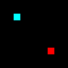

# bmp-js / Documentation / bmp_set_pixel
## Introduction

### Description

Set pixel RGBA value at X, Y coordinate of a resource

### Parameters

|#|Name|Description|Default Value|
|-|-|-|-|
|1|resource|BMPJS Resource||
|2|x|X axis||
|3|y|Y Axis||
|4|r|Color channel Red|null|
|5|g|Color channel Green|null|
|6|b|Color channel Blue|null|
|7|a|Color channel Alpha (untouched if null)|null|

### Returns
`true`

## Code examples

```js
// Create a sample picture
var resource = bmp_create(10, 10);

// Place blue and red pixels at [2, 2] and [7, 7] coordinates
bmp_set_pixel(resource, 2, 2,   0, 255, 255);
bmp_set_pixel(resource, 7, 7, 255,   0,   0);

// Spawn the image into the container
bmp_spawn(resource, container);
```

## Expected Result (10x zoom)


