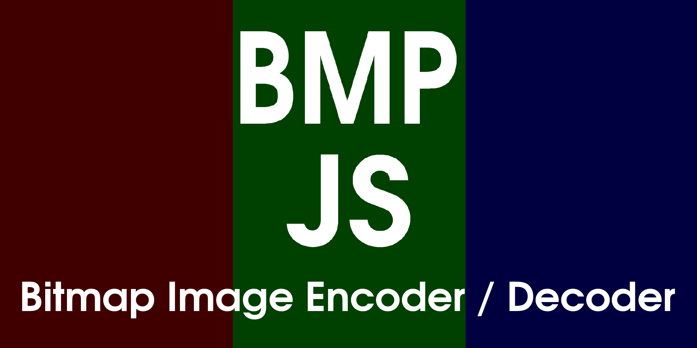

Clone the repo locally by running `git clone https://github.com/oxou/bmp-js`
and browse the `demo` folder for examples of what this library can do.

## Documentation
See [here](docs/readme.md).

## What is the purpose of this?

It may not serve any purpose other than to work on it and in the meantime expand knowledge about data and image
processing and various algorithms used alongside it and use that knowledge to build image filters and so on.

In my honest opinion I do not think one should deploy this library inside a production environment albeit I do know it
is production-ready and perhaps where it could be applicable to save on maintenance and implementation resources but
for me personally this project is here primarily for me to learn something new and hopefully for newcomers to learn as
well, and then in the future use this knowledge in other projects and implementations.

## Features

- Encode/Decode Bitmap Images.
- Write code that works per-pixel.
- Code can interchangeably work on 2 or more images.
- Sharing of color data between 2 or more images, for example `denoiser`.
- Automatically decodes images as 32-bit (even if they're 24)
- Canvas support has been added for animation purposes and performance.
- Pretty much anything can be generated if you put enough effort to it.

## Limitations
- Cannot produce animations because of high memory consumption and the inability to free Blobs from volatile memory.
- Missing lots of vital plot and mod functions.
- Bugs do still exist ;)
